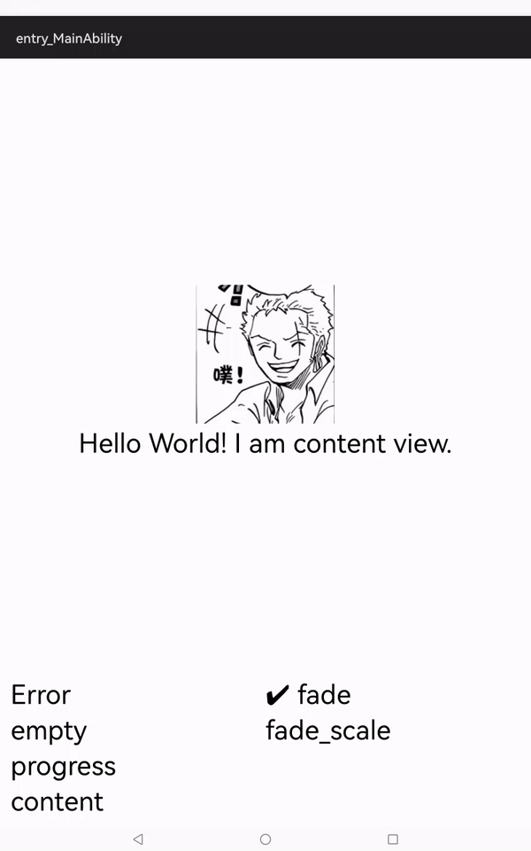
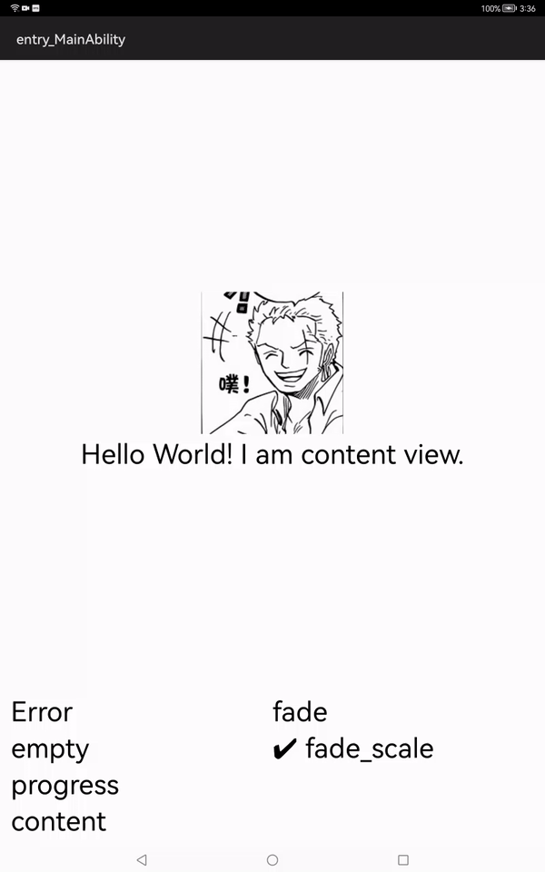

# StateLayout
A custom layout that can easily switch different states(like empty,error,progress,content) with animations.

### Source

---
This library has been inspired by [lufficc/iShuiHui](https://github.com/lufficc/iShuiHui)



### Integration
**From Source**
1. For using StateLayout module in sample app, include the source code and add the below dependencies in entry/build.gradle to generate hap/support.har.
    ```groovy
    implementation project(path: ':stateLayout')
    ```
2. For using StateLayout module in separate application using har file, add the har file in the entry/libs folder and add the dependencies in entry/build.gradle file.
    ```groovy
   implementation fileTree(dir: 'libs', include: ['*.har'])
   
### Usage

----
## Add StateLayout to your layout file
### *Remember ,StateLayout can only hold one direct child* #
```xml
<?xml version="1.0" encoding="utf-8"?>
<com.lufficc.statelayout.StateLayout
    xmlns:ohos="http://schemas.huawei.com/res/ohos"
    ohos:id="$+id:stateLayout"
    ohos:height="match_parent"
    ohos:width="match_parent" >
    <DirectionalLayout
        ohos:height="match_parent"
        ohos:width="match_parent"
        ohos:alignment="center">

        <Image
            ohos:height="match_content"
            ohos:width="match_content"
            ohos:image_src="$media:avatar"
            ohos:layout_alignment="horizontal_center"/>

        <Text
            ohos:height="match_content"
            ohos:width="match_content"
            ohos:multiple_lines="true"
            ohos:text="Hello World! I am content view."
            ohos:text_size="$float:text_size"
            />
    </DirectionalLayout>
</com.lufficc.statelayout.StateLayout>

```

## operation in java
```java
stateLayout.showErrorView(); //switch to error view
stateLayout.showErrorView(msg); //switch to error view with a message

stateLayout.showEmptyView();  //switch to empty view
stateLayout.showEmptyView(msg);  //switch to empty view with a message

stateLayout.showProgressView();  //switch to progress view
stateLayout.showProgressView(msg);  //switch to progress view with a message

stateLayout.showContentView();  //switch to your content view
```
## Custom Animation

you can custom your own animation by implements ViewAnimProvider interface,
by default,there are two simple animations, `FadeViewAnimProvider` and `FadeScaleViewAnimProvider`

```java
public interface ViewAnimProvider {
    AnimatorProperty showAnimation();

    AnimatorProperty hideAnimation();
}

//or

stateLayout.setHideAnimation(yourAnimation);
stateLayout.setShowAnimation(yourAnimation);

stateLayout.setViewSwitchAnimProvider(new FadeViewAnimProvider()); //user it
```


### attrs

|    attr              |     for                        |
|----------------------|--------------------------------|
| app:errorDrawable    | custom the error drawable      |
| app:emptyDrawable    | custom the empty drawable      |
### listener
```java

setErrorAction(ClickedListener onErrorButtonClickedListener ); // set a callback called where error view is clicked,
// you can retry, load data,for example

setEmptyAction(ClickedListener onEmptyClickedListener ); // set a callback called where empty view is clicked

```
Take a look at the [sample project](entry) for more information.

# License
Check the [LICENSE](LICENSE) file